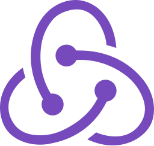

**I am a Software Engineer who would like to automate things in life.**

**My primary tech stacks are:**

          

**I am learning**

 

**To learn more about me or have an idea but don't know how to bring your ideas into life, please do contact me via [LinkedIn](https://www.linkedin.com/in/pramish-luitel/) or [Twitter](https://twitter.com/i_am_pramish).**

**I am an author at [Medium](https://medium.com/@luitelpramish7) for [Better Programming](https://betterprogramming.pub/), [The Startup](https://medium.com/swlh), [Analytics Vidhya](https://medium.com/analytics-vidhya) and [Geek Culture](https://medium.com/geekculture). You can find my latest articles at my profile.**

## My Favourite wallpaper


## My Favourite code

```
import express from "express";
const app = express();
const PORT = process.env.PORT || 5000
app.listen(PORT, ()=>{
    console.log(`Pramish is listening at PORT 5000`);
})
```

### My permanent address is: http://localhost:3000. Sometimes you can find me at http://localhost:5000/graphql

# Happy Coding!
